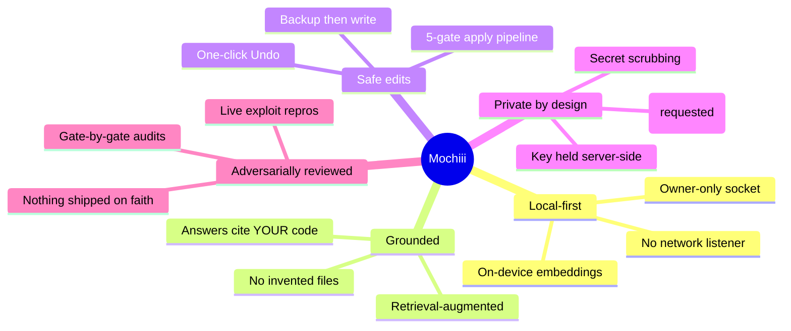
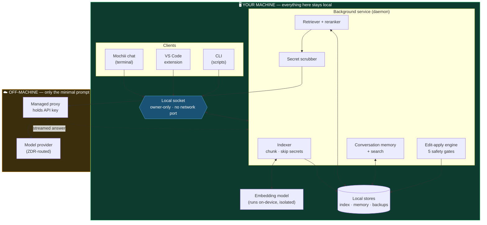
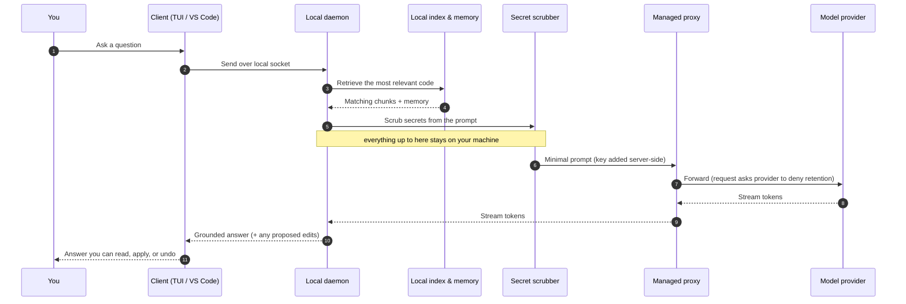
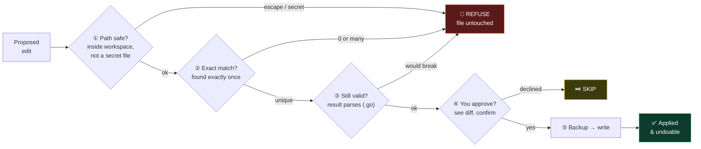
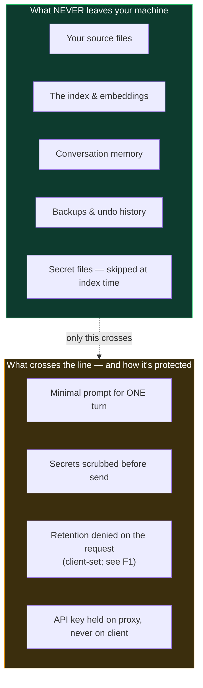

# Mochiii — Product Overview

> **Your codebase never leaves your machine unless *you* decide it should.**
> Mochiii is a local-first AI coding assistant that reads, understands, and
> edits your repository from a background service on your own machine — with a
> safety and privacy posture engineered before a single feature was shipped.

---

## TL;DR

**Mochiii** is an AI pair-programmer that lives on your machine, not in the
cloud. A local background service indexes your workspace, retrieves the exact
code your question is about, and grounds every answer in *your* real files. When
it proposes a change, that change passes through a five-gate safety pipeline
before a single byte is written — and every write is backed up and undoable. The
only thing that ever leaves your machine is the minimal prompt for one inference
turn, sent through a proxy that holds the credential server-side — with zero data
retention **requested** on the wire (a policy set client-side, not yet enforced
end-to-end; see §7). Your code, index, memory, and backups all stay local.

### Quick facts

| | |
|---|---|
| 🖥️ **Where it runs** | Entirely on your machine — no cloud service, no account, no network listener |
| 📤 **What leaves your machine** | Only the minimal prompt for a single inference turn — scrubbed of secrets; retention **requested** off (client-set, not yet enforced — see §7) |
| ✍️ **How edits apply** | As precise `SEARCH/REPLACE` edits through 5 safety gates; every write backed up and undoable |
| 🔒 **Privacy default** | Zero data retention **requested** on the wire (set client-side, not yet enforced — see §7); API key held server-side, never on the client |
| 🧩 **How you use it** | A chat terminal (Mochiii), a VS Code extension, and a scriptable CLI — all over one shared engine |

---

## Contents

**Part I — The Idea**
- [1. What is Mochiii?](#1-what-is-mochiii)
- [2. Why it exists](#2-why-it-exists)
- [3. What makes it special](#3-what-makes-it-special)

**Part II — How It Works**
- [4. The big picture](#4-the-big-picture)
- [5. A question's journey](#5-a-questions-journey)
- [6. How edits stay safe](#6-how-edits-stay-safe)
- [7. How your privacy holds](#7-how-your-privacy-holds)

**Part III — What You Get**
- [8. Feature catalogue](#8-feature-catalogue)
- [9. Where Mochiii excels](#9-where-mochiii-excels)

---

# PART I — THE IDEA

## 1. What is Mochiii?

Mochiii is an AI assistant for writing and changing code, with one defining
choice: **it runs on your computer instead of in the cloud.** It reads your whole
project locally, answers questions grounded in your actual files, and makes edits
that you review and can undo — all without uploading your source code to anyone.

Think of it as a careful pair-programmer that (a) actually knows your codebase
because it read it locally, and (b) never applies a change on faith.

> **Key terms in plain English** — the few words that show up throughout this doc:
>
> | Term | What it means here |
> |---|---|
> | **Daemon** | A background program that runs quietly on your machine and does the real work. Mochiii's daemon holds the index, the memory, and the safety engine. |
> | **Indexing / retrieval** | Reading your project once and organizing it so the right pieces can be pulled up instantly when a question relates to them. |
> | **Embeddings** | A way of turning code into numbers that capture meaning, so "find the code that does X" works even when you don't know the exact words. Computed **on your machine**. |
> | **Zero data retention (ZDR)** | A guarantee that the model provider does not keep your prompt after answering it. In Mochiii this retention policy is **requested**, not yet enforced end-to-end — see §7. |

---

## 2. Why it exists

Modern AI coding tools ask you to make a trade you shouldn't have to make:
**give up control and privacy to get intelligence.** Your source code is
uploaded, your prompts are retained, edits are applied to your files with a
"trust me," and the whole thing runs on someone else's server.

Mochiii's thesis is the opposite:

| The industry default | Mochiii's stance |
|---|---|
| Your code is uploaded and indexed in the cloud | Indexing, embeddings, and retrieval happen **on your machine** |
| Prompts and completions are retained by the provider | **Zero data retention** requested on every call (client-side routing flags; end-to-end enforcement is backlog F1, not yet shipped) |
| The tool has a network listener / account / login | **No network listener** — a local socket with owner-only permissions |
| Edits are applied on faith | Every edit passes **five safety gates**, is backed up, and is undoable |
| "It probably didn't leak your secrets" | Secrets are **skipped at index time and scrubbed at send time** |

The goal is a coding assistant that a security-conscious engineer, a regulated
team, or a privacy-minded solo developer can adopt **without auditing away their
peace of mind** — because the architecture, not a promise, is what protects them.

---

## 3. What makes it special


*The five pillars Mochiii is built on — expanded below.*

**1. It is grounded in *your* repository, locally.** An on-device embedding model
indexes your workspace and a hybrid retriever + reranker surfaces the precise
code your question is about. Answers are anchored to real files, not invented ones.

**2. It edits code safely, or it refuses.** Proposed changes are structured
`SEARCH/REPLACE` edits that must survive path, exact-match, syntax, human-confirm,
and backup gates. If an edit is ambiguous, stale, or would corrupt a file, Mochiii
**refuses rather than guesses.**

**3. Privacy is structural, not a setting.** There is no network listener. The
inference credential is never on the client. The wire request asks the provider to
deny retention (a policy requested client-side, not yet enforced end-to-end — see
§7). Secrets are stripped before anything is sent. These are properties of the
design, not toggles you have to remember to flip.

**4. Every safety claim was earned adversarially.** The safety model was
pressure-tested with live exploit reproductions — path-escape symlinks,
secret-name bypasses, socket confused-deputy scenarios, concurrent-write races —
and hardened until the repros went to zero. Claims are verified, not assumed.

---

# PART II — HOW IT WORKS

## 4. The big picture

Everything in the green box below is **your machine**. Only the orange box is
off-machine, and only the minimal prompt for one inference turn ever crosses that
line — with the credential on the proxy, not the client, and the request asking the
provider to deny retention (see §7 on enforcement).


*The whole system: three clients, one local service, and a single guarded hop off-machine.*

### The components

| Component | What it does |
|---|---|
| **Clients** | Three front-ends over the same service: the **Mochiii** chat terminal, the **VS Code** extension, and a scriptable **CLI**. None reimplement safety logic — they all drive the one daemon. |
| **Local socket** | The only way to reach the daemon: owner-only permissions, no listening network port, discovery via a local lockfile — nothing guessed, nothing exposed. |
| **Indexer** | Walks the workspace, chunks code, and **skips secret files** (`.env`, `*.pem`, keys…) so they never enter the index in the first place. |
| **Embedding model** | Runs in a separate, isolated subprocess on your machine — your code is turned into searchable meaning without leaving the box. |
| **Retriever + reranker** | Finds the most relevant code for a query, tuned so real implementation out-ranks boilerplate and test noise. |
| **Edit-apply engine** | The five-gate pipeline that turns a proposed change into a safe, backed-up, undoable write — shared by *every* client. |
| **Conversation memory** | Per-workspace store for in-session context and cross-session recall, with full-text **search** over past conversations. |
| **Secret scrubber** | Redacts recognizable secrets from retrieved code **at send time**, as a second line of defense beyond the index-time skip. |
| **Managed proxy** | Holds the inference API key server-side so the client never carries the credential. It forwards the request byte-for-byte, including the client-set zero-data-retention routing flags — it does **not** itself enforce ZDR (backlog F1). |

---

## 5. A question's journey

Here's what actually happens, end to end, when you ask Mochiii a question — the
path a single request takes and where the privacy guarantees kick in.


*One request, one guarded hop off-machine — the boundary is crossed exactly once, with the smallest possible payload.*

If the answer includes a code change, it doesn't touch your disk yet — it goes
through the safety pipeline next.

---

## 6. How edits stay safe

When Mochiii proposes a `SEARCH/REPLACE` change, it does **not** touch your disk
until it clears every gate below. Any gate can refuse — and a refusal means the
file is left exactly as it was.


*Five gates, in order — a change only reaches your disk if it passes all of them.*

| Gate | Guarantee |
|---|---|
| **① Path safety** | The target must resolve (through symlinks) to inside the workspace. Absolute paths, `..` escapes, and secret files are refused. |
| **② Exact match** | The `SEARCH` text must appear **exactly once**. Zero matches → "not found." More than one → "ambiguous, refusing." Never a best-guess. |
| **③ Syntax gate** | For Go files, the post-edit content must still parse. An edit that would produce unparseable garbage is refused. |
| **④ Diff + confirm** | You see the change as a red/green diff and approve it explicitly. Nothing applies on faith — and auto-apply mode still runs the same gates. |
| **⑤ Backup → write** | The original is copied to a timestamped backup **before** the write. Die mid-write and the original is recoverable; change your mind and **Undo** restores it. |

**Undo is honest.** If a file changed *since* the apply run, Undo won't silently
clobber it — it reports that file as *guarded* rather than folding it into a
misleading success count. Backups are bounded (newest sessions retained), and any
recent run stays independently undoable.

---

## 7. How your privacy holds


*Almost everything stays local; the little that crosses is minimized, scrubbed, and not retained.*

**Layered defense for your secrets:**

1. **Index-time skip** — secret-shaped files never enter the index, so they can't
   be retrieved as context in the first place.
2. **Send-time scrub** — retrieved code is scanned and recognizable secrets
   (private-key blocks, known API-key prefixes) are redacted before the prompt
   leaves the machine.
3. **Zero data retention (requested — not yet enforced end-to-end).** The wire
   request denies data collection and restricts routing to retention-compliant
   providers. These flags are set **client-side** by the daemon; the managed proxy
   forwards them but does not itself enforce ZDR, and end-to-end enforcement and
   verification remain open work (backlog **F1**). Treat ZDR as an intended design
   goal, not a guarantee to rely on today.
4. **Credential isolation** — the API key lives on the managed proxy, not on any
   client, so a compromised client can't exfiltrate it.

**Assurance is a practice, not a checkbox.** Mochiii's safety claims are subjected
to adversarial, gate-by-gate security review with *live* exploit reproductions —
path-escape symlinks, secret-name bypasses, socket confused-deputy access,
concurrent-write races. When a repro fires, it's fixed and re-run until it goes to
zero, with regression tests that fail if the fix is ever removed. Nothing is marked
"safe" because someone read the code and nodded — it's marked safe because the
attack was run and stopped. Hardening is ongoing and tracked openly in the project
backlog; the discipline *is* the product's assurance.

---

# PART III — WHAT YOU GET

## 8. Feature catalogue

### 🧠 Understands your codebase
- On-device workspace indexing with an embedding model that never uploads code
- Hybrid retrieval + reranking tuned to surface implementation over boilerplate
- Grounded answers anchored to your real files — with graceful degradation when
  the index isn't ready

### ✍️ Edits code safely
- `SEARCH/REPLACE` edits through the five-gate apply pipeline
- Red/green diff review with explicit per-edit confirmation
- Optional session-scoped **auto-apply** mode (still fully gated; resets to off)
- Timestamped backups, bounded retention, and honest multi-run **Undo**

### 💬 Remembers the conversation
- In-session context threading across turns
- Cross-session memory persisted per workspace
- Full-text **search** over past conversations, right in the UI

### 🖥️ Meets you where you work
- **Mochiii** interactive chat terminal
- **VS Code extension** — chat panel, in-editor diff-apply, native Undo button,
  conversation search
- **CLI** for scripts and one-shot `edits apply` / `edits undo`

### 🔒 Protects you by default
- No network listener; local socket with owner-only permissions
- Zero data retention **requested** on the wire (client-set routing flags; end-to-end enforcement is backlog F1, not yet shipped)
- Secret files skipped at index time, secrets scrubbed at send time
- Inference credential held server-side on the managed proxy

---

## 9. Where Mochiii excels

```mermaid
quadrantChart
    title Privacy vs. Capability
    x-axis "Low capability" --> "High capability"
    y-axis "Cloud-dependent / uploads code" --> "Local-first / private"
    quadrant-1 "The goal: capable AND private"
    quadrant-2 "Private but limited"
    quadrant-3 "Neither"
    quadrant-4 "Capable but you pay in privacy"
    "Plain cloud chatbot": 0.35, 0.25
    "Cloud AI IDE": 0.8, 0.2
    "Local model, no context": 0.3, 0.85
    "Mochiii": 0.82, 0.88
```
*Most tools force a choice between capable and private. Mochiii aims for the top-right corner.*

Mochiii's edge is that it refuses the usual trade-off — **cloud-grade grounded
intelligence with local-first privacy** — instead of forcing you to pick one axis:

- **Privacy without sacrificing grounding.** Your code is indexed and retrieved
  locally; only the minimal, scrubbed, non-retained prompt is sent.
- **Safe automation.** It confidently applies the edits it's sure of and cleanly
  refuses the ones it isn't — the opposite of a tool that applies everything and
  hopes.
- **Trustworthiness.** The safety guarantees are backed by live adversarial
  testing and regression tests, not marketing copy.
- **Fits your workflow.** One service, three front-ends, shared safety logic — the
  same guarantees whether you're in the terminal, in VS Code, or scripting the CLI.

---

## In one line

> **Mochiii is the coding assistant that reads your whole repo, edits it safely,
> and keeps it yours — because privacy and safety were the architecture, not the
> afterthought.**

---

*This document is a product overview. For deep technical and security detail, see
[`README.md`](README.md), [`SECURITY_MODEL.md`](SECURITY_MODEL.md), and the living
[`BACKLOG.md`](BACKLOG.md) where the engineering and hardening work is tracked in
the open.*
